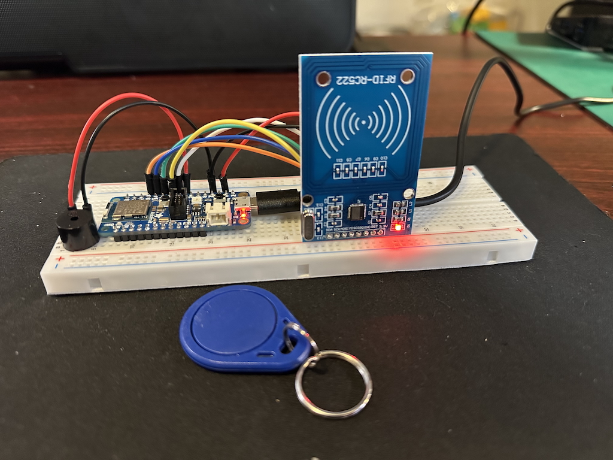
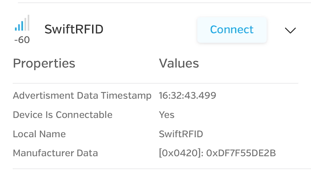

# Swift Zephyr RFID Example

This is a simple example project that shows off how Swift can interop with Zephyr using CMake. This example shows off integration with the following features:

- GPIO LED / Output
- Bluetooth (Advertising)
- SPI

> [!NOTE]
> Much of the code in this example is based off the work of [Eric Bariaux](https://www.ericbariaux.com/). He was kind enough to share his Swift -> Zephyr examples for the nRF52, which helped significantly with getting started and building this example as well. Check out the [nelcea](https://github.com/nelcea) repo on GitHub for more awesome examples from Eric!

## Hardware Requirements

This example is coded to work with the [Adafruit Feather nRF52840 Express](https://docs.zephyrproject.org/latest/boards/adafruit/feather_nrf52840/doc/index.html), but can also work with other BLE-enabled boards with an additional overlay file in the boards/ directory.

Other required/recommended hardware:

- MFRC522 Card Reader ([available on Amazon](https://www.amazon.com/mfrc522/s?k=mfrc522))
- Beeper / Buzzer ([like these ones for Arduino](https://www.amazon.com/Cylewet-Electronic-Magnetic-Continuous-Arduino/dp/B01N7NHSY6/ref=sr_1_3?crid=1S4NKFVKHYDJR&dib=eyJ2IjoiMSJ9.-8FtNMfHU_VTc9hGqdmX2KVN9UWUcC3HtnXNezyEx6SmfXSz7L8lO02t-zpWGerHkr9oIr6K2a2RKdLa4CKBFdvt327jBtZrtaGYikjXlSSIyl0MHkNJuStaDi0Hh8-uGbRYsi6VFnjWwXmAQAoFVnPVSsp589Zn7OfByAIp4aQG9yWXzZjy1QifxkrIQY5IW-BjNI2PTqHtJI5PPl_zlyFMroF4qdZQ7US7AoPgZ1g.3wjaIodJkb0SLtDW7zGm95aMLlp8qY3q4pqzQP2Zoak&dib_tag=se&keywords=buzzer+embedded&qid=1746564542&sprefix=buzzer+embedde%2Caps%2C122&sr=8-3))
- Breadboard (optional), these can be purchased from Amazon, Adafruit, Digikey, etc...

Something like this can be constructed:



When the RFID tag is scanned, the BLE manufacturer data is set to the 5-bytes scanned from the (Mifare) tag. In the LightBlue app (recommended), the RFID tag appears like this in the scanning list:



## Software Requirements

In order to build this example, you'll need to install the following components:

 - Swift 6.1 or later, using the [official instructions](https://www.swift.org/install/linux/).
 - Zephyr SDK using the [Getting Started Guide](https://docs.zephyrproject.org/latest/develop/getting_started/index.html)).
 - The SEGGER J-Link tools which are available [here](https://www.segger.com/downloads/jlink).
 - The `nrfutil` binary, which depends on the SEGGER J-Link tools and is available [here](https://www.nordicsemi.com/Products/Development-tools/nRF-Util/Download#infotabs).

### Building

Start by sourcing Zephyr to get into the venv:

```bash
$ source ~/zephyrproject/.venv/bin/activate
```

A handy build script has been provided that will compile the firmware for the `adafruit_feature_nrf52840` for you:

```bash
$ ./build.sh
...
[216/216] Linking C executable zephyr/zephyr.elf
Memory region         Used Size  Region Size  %age Used
           FLASH:      129456 B         1 MB     12.35%
             RAM:       18880 B       256 KB      7.20%
        IDT_LIST:          0 GB        32 KB      0.00%
Generating files from ~/swift-zephyr-rfid/build/zephyr/zephyr.elf for board: adafruit_feather_nrf52840
```

Or, the same can be done using `west` if `ZEPHYR_BASE` is set to point to your local Zephyr installation:

```bash
$ ZEPHYR_BASE=~/zephyrproject/zephyr
$ west build -p always -b adafruit_feather_nrf52840 .
...
[216/216] Linking C executable zephyr/zephyr.elf
Memory region         Used Size  Region Size  %age Used
           FLASH:      129456 B         1 MB     12.35%
             RAM:       18880 B       256 KB      7.20%
        IDT_LIST:          0 GB        32 KB      0.00%
Generating files from ~/swift-zephyr-rfid/build/zephyr/zephyr.elf for board: adafruit_feather_nrf52840
```

### Programming

Another handy-dandy script is provided to program the device, verify the firmware, and reset it using `nrfutil`:

```bash
$ ./program.sh
[00:00:02] ###### 100% [2/2 802001236] Programmed
✔️ Firmware was verified on 802001236
✔️ Reset was applied to 802001236
```

Or, if using `west`, use the `flash` command:

```bash
$ west flash
-- west flash: rebuilding
ninja: no work to do.
-- west flash: using runner jlink
-- runners.jlink: reset after flashing requested
-- runners.jlink: JLink version: 8.26
-- runners.jlink: Flashing file: ~/swift-zephyr-rfid/build/zephyr/zephyr.hex
```
